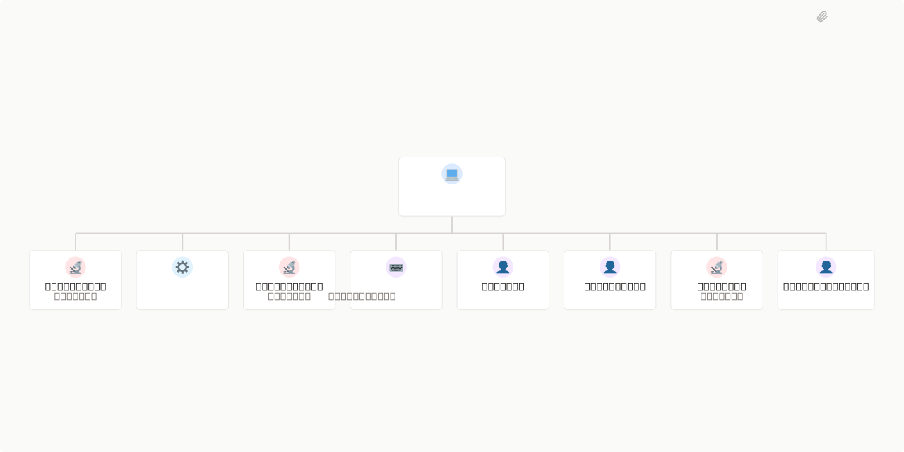

# Pharmia



## What's Inside

> This is an [Agent Company](https://agentcompanies.io) package from [Paperclip](https://paperclip.ing)

| Content | Count |
|---------|-------|
| Agents | 9 |
| Skills | 34 |
| Tasks | 1 |

### Agents

| Agent | Role | Reports To |
|-------|------|------------|
| Bug-Hunter | qa | engineering-lead |
| Dokploy-Ops | devops | engineering-lead |
| E2E-Harness | qa | engineering-lead |
| Engineering Lead | CTO | — |
| Implementer | Engineer | engineering-lead |
| Planner | pm | engineering-lead |
| Researcher | researcher | engineering-lead |
| Reviewer | qa | engineering-lead |
| Security-Agent | security | engineering-lead |

### Skills

| Skill | Description | Source |
|-------|-------------|--------|
| clarification-gate | Use before planning or implementing any task — surfaces ambiguities, classifies them, and blocks work on unresolved blockers | catalog |
| code-review-excellence | Master effective code review practices to provide constructive feedback, catch bugs early, and foster knowledge sharing while maintaining team morale. Use when reviewing pull requests, establishing review standards, or mentoring developers. | catalog |
| context7-mcp | This skill should be used when the user asks about libraries, frameworks, API references, or needs code examples. Activates for setup questions, code generation involving libraries, or mentions of specific frameworks like React, Vue, Next.js, Prisma, Supabase, etc. | catalog |
| critique | Evaluate design effectiveness from a UX perspective. Assesses visual hierarchy, information architecture, emotional resonance, and overall design quality with actionable feedback. | catalog |
| debugging-wizard | Use when investigating errors, analyzing stack traces, or finding root causes of unexpected behavior. Invoke for error investigation, troubleshooting, log analysis, root cause analysis. | catalog |
| deletion-bias | Use during implementation — enforces minimal code, net-negative LOC, and prevents over-engineering and premature abstraction | catalog |
| duplication-detect | Find and eliminate code duplication with DRY refactoring strategies | catalog |
| frontend-design | Create distinctive, production-grade frontend interfaces with high design quality. Use this skill when the user asks to build web components, pages, artifacts, posters, or applications. Generates creative, polished code that avoids generic AI aesthetics. | catalog |
| harden | Improve interface resilience through better error handling, i18n support, text overflow handling, and edge case management. Makes interfaces robust and production-ready. | catalog |
| json-render-core | json-render @json-render/core API: schemas, catalogs, SpecStream compilers, validateSpec/autoFixSpec, diffToPatches, createStateStore. Use when working with the backend catalog or fence-extraction pipeline. | catalog |
| json-render-react | json-render @json-render/react API: Renderer, JSONUIProvider, useJsonRenderMessage, useStateStore, useBoundProp, defineRegistry. Use when wiring frontend renderers, message-parts consumption, or component registries. | catalog |
| json-render-shadcn | json-render @json-render/shadcn pre-built shadcn components (Card, Stack, Select, Input, etc.). Reference when consolidating Pharmia's hand-rolled catalog primitives. | catalog |
| n8n-architect | Expert assistant for n8n workflow development. Use when the user asks about n8n workflows, nodes, automation, or needs help creating/editing n8n JSON configurations. Provides access to complete n8n node documentation and prevents parameter hallucination. | catalog |
| pharmia-agents | Pharmia agent architecture, model defaults, eval system, and key file paths | catalog |
| pharmia-cli | Pharmia CLI commands: evals, agent testing, tool invocation, workflows, and Outline operations | catalog |
| pragmatic-programmer | 'Apply meta-principles of software craftsmanship: DRY, orthogonality, tracer bullets, and design by contract. Use when the user mentions "best practices", "pragmatic approach", "broken windows", "tracer bullet", or "software craftsmanship". Covers estimation, domain languages, and reversibility. For code-level quality, see clean-code. For refactoring techniques, see refactoring-patterns.' | catalog |
| receiving-code-review | Use when receiving code review feedback, before implementing suggestions, especially if feedback seems unclear or technically questionable - requires technical rigor and verification, not performative agreement or blind implementation | catalog |
| researcher-workflow | Use before building anything new — enforces library doc verification, existing solution search, and capability verification before writing custom code | catalog |
| review-protocol | Use after implementation is complete — 8-phase verification protocol covering build, types, lint, tests, security, diff review, acceptance criteria, and final verdict | catalog |
| search-first | Research-before-coding workflow. Search for existing tools, libraries, and patterns before writing custom code. Invokes the researcher agent. | catalog |
| spec-miner | Use when understanding legacy or undocumented systems, creating documentation for existing code, or extracting specifications from implementations. Invoke for legacy analysis, code archaeology, undocumented features. | catalog |
| systematic-debugging | Use when encountering any bug, test failure, or unexpected behavior, before proposing fixes | catalog |
| testing-intelligence | Use when writing tests, reviewing test quality, or deciding what to test — enforces prioritization, quality rules, and mutation testing standards | catalog |
| verification-before-completion | Use when about to claim work is complete, fixed, or passing, before committing or creating PRs - requires running verification commands and confirming output before making any success claims; evidence before assertions always | catalog |
| vitest | Vitest testing framework patterns for test setup, async testing, mocking with vi.*, snapshots, and test performance (formerly test-vitest). This skill should be used when writing or debugging Vitest tests. This skill does NOT cover TDD methodology (use test-tdd skill), API mocking with MSW (use test-msw skill), or Jest-specific APIs. | catalog |
| workflow | Use the full SDD pipeline for this task. | catalog |
| diagnose-why-work-stopped | > | [github](https://github.com/paperclipai/paperclip/tree/master/skills/diagnose-why-work-stopped) |
| paperclip-converting-plans-to-tasks | > | [github](https://github.com/paperclipai/paperclip/tree/master/skills/paperclip-converting-plans-to-tasks) |
| paperclip-create-agent | > | [github](https://github.com/paperclipai/paperclip/tree/master/skills/paperclip-create-agent) |
| paperclip-create-plugin | > | [github](https://github.com/paperclipai/paperclip/tree/master/skills/paperclip-create-plugin) |
| paperclip-dev | > | [github](https://github.com/paperclipai/paperclip/tree/master/skills/paperclip-dev) |
| paperclip | > | [github](https://github.com/paperclipai/paperclip/tree/master/skills/paperclip) |
| para-memory-files | > | [github](https://github.com/paperclipai/paperclip/tree/master/skills/para-memory-files) |
| terminal-bench-loop | > | [github](https://github.com/paperclipai/paperclip/tree/master/skills/terminal-bench-loop) |

## Getting Started

```bash
pnpm paperclipai company import this-github-url-or-folder
```

See [Paperclip](https://paperclip.ing) for more information.

---
Exported from [Paperclip](https://paperclip.ing) on 2026-05-18
