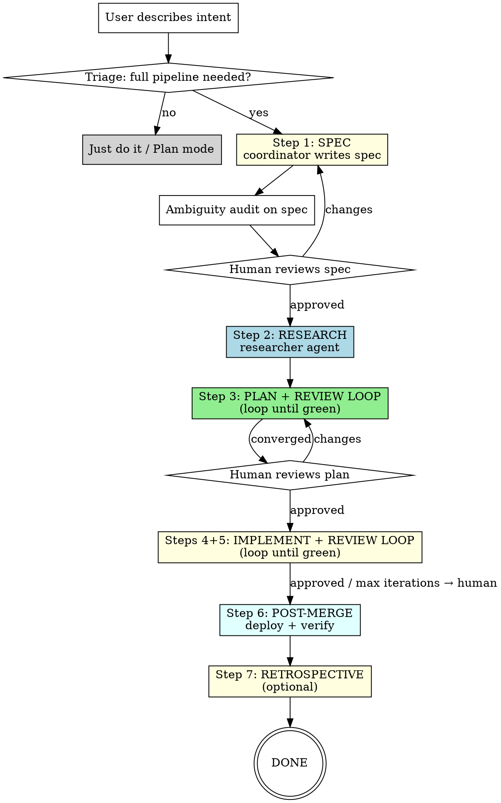

# Spec Driven Development Pipeline

Full pipeline: **Spec -> Research -> Plan -> Plan Review -> Implement -> Review -> Post-Merge -> Retrospective**.

Each step reduces ambiguity. By the time the agent writes code, it has everything: what the feature does, how it integrates, edge cases, tests, and architecture.

## Coordinator Role

The coordinator (main Claude session) is the **only actor that can talk to the human**. Subagents run autonomously and return output — they cannot ask the user questions directly.

**The coordinator is responsible for:**
1. Reading subagent output for flagged ambiguities (BLOCKING / DEFAULTABLE / SELF-RESOLVED)
2. Collecting all BLOCKING items and **asking the user** before proceeding to the next step
3. Applying DEFAULTABLE items with stated defaults (user can override)
4. Feeding user answers into the next subagent's prompt as resolved constraints

**When to ask:** After any step that surfaces ambiguities — typically after the spec ambiguity audit (Step 1) and after the planner's clarification gate (Step 3). Never proceed past a gate with unresolved BLOCKING items.

## When to Use

- Multi-file features touching 4+ files across multiple domains
- New user-facing workflows with authorization, state machines, or multi-step flows
- Legacy code modifications where behavior is unclear or untested
- Features where getting it wrong has security or data integrity consequences

## When NOT to Use

- Single-file bug fix with obvious root cause -> just fix it
- Config change, dependency bump, typo fix -> no pipeline needed
- Adding a field to an existing CRUD endpoint with existing patterns -> Plan mode at most

## Middle Ground (partial pipeline)

Not every non-trivial task needs the full pipeline. Use partial pipelines for:

- **2-3 file changes with clear scope:** Skip Spec + Research, write a Plan directly, then implement. The plan catches file-level gaps without the overhead of a full spec.
- **Modification tasks (not greenfield):** Skip Spec if the existing behavior is well-understood. Research + Plan + Implement is enough when you are changing, not inventing.
- **Auth-touching bug fixes:** Always use at least the Plan step. Auth changes have hidden blast radius (scopes, guards, tenant checks, role gates). A plan forces you to enumerate all affected paths before touching code.

**Decision heuristic:** If you would feel uncomfortable merging without a second pair of eyes reading a plan, use at least the Plan step.

## Pipeline



## Step 1: SPEC (functional layer)

The coordinator writes the spec: purpose, use cases, requirements, edge cases, acceptance criteria. Technology-agnostic. Use `/clarification-gate` to surface ambiguities.

The spec answers WHAT, not HOW. Keeping functional and technical separate reduces LLM uncertainty — the agent does not juggle two concerns simultaneously.

Save to: `docs/specs/YYYY-MM-DD-<topic>.md` (use project template).

After the spec is written, run an **ambiguity audit**: ask "what ambiguities exist in this spec that would force an implementing agent to guess?" Surface them as BLOCKING / DEFAULTABLE / SELF-RESOLVED.

**Optional structural review (for complex specs):** For specs with 5+ requirements or auth/security changes, dispatch a `reviewer` agent to verify structural completeness before the human sees it. The reviewer checks:
- Every use case has at least one requirement tracing to it
- Every requirement has at least one acceptance criterion
- Entry points (routes, API endpoints, UI triggers) are populated, not left as "TBD"
- Edge cases address state machine transitions (not just happy path)
- Security invariants are explicit (who can do what, tenant boundaries, role gates)

Skip this for simple specs (2-3 requirements, no auth changes). The coordinator fixes any structural gaps directly before presenting to the human.

**Coordinator action:** Present the spec to the human along with any BLOCKING ambiguities as explicit questions. Do not proceed until all BLOCKING items are resolved. Then present the full spec for approval.

**Gate:** Human approves spec before proceeding.

## Step 2: RESEARCH (existing solutions)

Dispatch `researcher` agent with the approved spec as input.

The researcher:
- Searches codebase for existing patterns that overlap
- Evaluates libraries (Adopt > Extend > Compose > Build)
- Runs `/spec-miner` if modifying existing code
- Produces structured report with confidence levels

### Research completeness check

Before feeding research into planning, the coordinator verifies:
1. Every REQ in the spec is covered by at least one research finding (library evaluation, existing pattern, or explicit "nothing found")
2. The report has no missing sections: Components Evaluated, DRY Analysis, and Caveats must all be present
3. Low-confidence recommendations are flagged (the planner needs to know what is uncertain)

If gaps are found, re-dispatch the researcher with specific questions. This is a coordinator gate, not a human gate — the coordinator can resolve it without asking the user.

## Step 3: PLAN + REVIEW LOOP (loop until green)

The coordinator writes the plan (or dispatches a `planner` agent), then runs an autonomous **loop** between the plan and a `reviewer` agent until the reviewer approves. The human only sees the converged result.

### Initial plan

The planner (or coordinator):
- Runs `/clarification-gate` on the spec — if BLOCKING items surface, **pause the loop** and ask the human before continuing
- Produces tasks (TASK-xxx) traced to requirements (REQ-xxx)
- Each task has a `Context:` field with all info needed for agent-agnostic execution
- Runs 4-Persona Audit including task count sanity check and security review
- Saves to `docs/plans/YYYY-MM-DD-<topic>.md`

**Key:** "Does it really need seven tasks, or can three cover it?" Explicitly check for over-tasking.

### Loop protocol

```
iteration = 0
max_iterations = 10

while iteration < max_iterations:
    dispatch reviewer agent with PLAN_REVIEW_PROMPT (identical every time)
    if verdict == APPROVED and no important/warning-level findings:
        break
    else:
        apply the reviewer's specific changes to the plan directly
        iteration += 1

if iteration == max_iterations and not approved:
    present plan + unresolved findings to human for guidance
```

### Canonical review prompt

Use this exact prompt for every plan review dispatch. Never vary it. No iteration count, no prior findings, no hints. The agent reads the files itself.

```
PLAN_REVIEW_PROMPT:

Perform a thorough first-pass review of the implementation plan against the spec.

Spec: <spec file path>
Plan: <plan file path>

Read both files, then validate. Verdict: APPROVED (with severity of any findings) or CHANGES REQUESTED.
```

### Parallel review by subject

For large changes (10+ REQs, 5+ domains, 100+ files), a single reviewer agent produces shallow coverage. In these cases, dispatch **multiple reviewer agents in parallel**, each scoped to a subject area:

- Each agent gets the **same canonical prompt structure** (plan file path, first-pass framing, verdict format)
- Each agent gets a **scope clause** listing the REQs/ACs and files it owns
- Scopes must be **non-overlapping** — no file or requirement assigned to two agents
- **ZK principle applies per-agent:** no agent sees another agent's findings, no iteration hints, no prior-round context. Each agent is a fresh first-pass reviewer of its slice.
- **Convergence requires ALL agents to APPROVED.** If any agent returns CHANGES REQUESTED, apply fixes and re-dispatch that agent (not all of them) with the same clean prompt.
- Maximum **4 parallel reviewer agents** per round. Beyond 4, finding dedup and conflict resolution overhead outweighs depth gains.

**When to use single vs parallel:**
- **Single agent:** < 10 REQs, < 50 files, 1-2 domains. The canonical prompt covers it.
- **Parallel by subject:** 10+ REQs, 50+ files, 3+ domains (e.g., auth + billing + routing). Split by domain boundary.

**Rules:**
1. The coordinator applies reviewer fixes directly to the plan file — do NOT re-dispatch the planner agent for each iteration. The planner is expensive; the coordinator can make targeted edits.
2. **Zero-knowledge every dispatch.** Use canonical prompt structure verbatim — only the file paths and scope clause change between projects. The reviewer must not be able to distinguish iteration 1 from iteration 30. No iteration numbers, no prior findings, no "we fixed X", no hints of any kind. The plan file itself is the only thing that changes between iterations. This applies equally to single-agent and parallel-by-subject dispatches.
3. Cap at **10 iterations**. If the plan hasn't converged by then, present the remaining findings to the human.
4. After each fix, re-read the plan to verify the edit didn't introduce inconsistencies.
5. After applying fixes, **always re-dispatch the reviewer** for the next iteration. Do NOT present the plan to the human or ask to proceed — only the reviewer's APPROVED verdict exits the loop.
6. **Convergence = nits only.** An APPROVED verdict with important or warning-level findings is NOT converged. Apply the fixes and re-dispatch the reviewer. Only break the loop when the reviewer returns APPROVED with no important/warning-level findings (nits are acceptable). This applies to both plan review loops and implementation review loops.

<!-- Evolution: 2026-03-17 | evidence: coordinator broke plan review loop by presenting to human after applying fixes instead of re-dispatching reviewer | added explicit loop-back rule and visual boundary before After convergence -->
<!-- Evolution: 2026-03-18 | evidence: guest-pharmacist plan review — 6 rounds, clean-context (first-pass framing) vs incremental (check-my-fixes) reviews. Clean-context rounds consistently found new issues: R3 caught tautological security check (getHomeTenant vs itself), R5 caught getMyTenantMemberships gap and frontend type plumbing omission. Incremental rounds (R2, R4) mostly confirmed fixes. Odd rounds finding real issues, even rounds confirming = diminishing returns pattern. Clean context prevents anchoring bias where reviewer skips areas "already reviewed." | changed rule 2 from "include iteration number and prior findings" to "clean context, first-pass framing every time" -->
<!-- Evolution: 2026-03-18 | evidence: autumn-fingerprint plan review — R2 returned APPROVED with 1 important (broken test) + 1 warning (spec divergence). Coordinator treated APPROVED as converged, applied fixes without re-review. The important finding (test breakage) should have triggered another loop to verify the fix was correct. | added rule 6: convergence requires nits-only approval -->

### Reviewer checklist

The reviewer validates:
- Every REQ has at least one TASK, every AC traces to a REQ
- Task context is self-contained (an agent could execute it without reading the spec)
- No over-tasking — flag if task count seems inflated
- No missing acceptance criteria for key requirements
- Architecture decisions are justified, not just stated
- Risk mitigations are concrete, not hand-wavy
- Codebase references (file paths, line numbers, code patterns) are accurate
- All files that need changes are listed (forgotten files are a common gap)
- Security checks are non-tautological (verify the check actually compares distinct values)
- Frontend type plumbing is complete (session -> auth client -> context -> component)

---

### After convergence (ONLY after reviewer returns APPROVED)

Present the approved plan to the human with a summary:
- Number of iterations to convergence
- Key changes made during the loop
- Any DEFAULTABLE decisions the human might want to override

**Gate:** Human approves the converged plan before implementation.

## Steps 4+5: IMPLEMENT + REVIEW LOOP (loop until green)

The coordinator dispatches the implementer, then the reviewer, in an autonomous loop. The human only sees the final result after APPROVED or max iterations.

### Initial implementation

Dispatch `implementer` agent(s) with the approved plan as input. Use `/dispatching-parallel-agents` for independent tasks.
- Fresh subagent per task
- `/deletion-bias` active throughout

Tasks are self-contained and agent-agnostic. Independent tasks can run in parallel. You can swap agents mid-execution because context travels with the task, not the agent.

### Parallel dispatch protocol

When dispatching multiple implementer agents in parallel:

**Before dispatch:**
- **File overlap check:** No two agents may modify the same file. If tasks share a file, serialize them or merge into one task.
- **Dependency check:** Verify no task depends on another task's output (new type, new export, new DB column). Dependent tasks must run sequentially.
- **Batch size limit:** Maximum 4 parallel agents. Beyond 4, the coordinator loses ability to track blast radius and resolve conflicts.

**After agents return:**
- Run a single full test suite (not per-agent). Parallel agents may each pass individually but break each other's assumptions.
- If two agents modified adjacent code in the same file (despite the overlap check), resolve conflicts before the test run.
- Check all exit statuses. If any agent exits BLOCKED or NEEDS_CONTEXT, resolve that before running the review loop.

### Loop protocol

**Dispatch implementer first, then reviewer on the implementation.** The plan was already reviewed in Step 3 — re-reviewing it here is redundant. The reviewer's job in this step is to verify the *code*, not the plan.

**The implementer MUST use red-green TDD:** write/update tests first from the plan's acceptance criteria, run them to confirm they fail (red), then implement the code to make them pass (green). This ensures tests actually validate the new behavior.

```
iteration = 0
max_iterations = 10

initial dispatch:
    dispatch implementer agent with the approved plan (TDD: tests first, then code)
    wait for implementer to complete
    if implementer exits BLOCKED or NEEDS_CONTEXT → present to human immediately

loop (after initial implementation):
    dispatch reviewer agent with the plan + spec + current code state
    if verdict == APPROVED and no important/warning-level findings:
        break → proceed to "After convergence"
    else (CHANGES REQUESTED or APPROVED with important/warning):
        iteration += 1
        if iteration >= max_iterations:
            break → present unresolved findings to human
        dispatch implementer agent with:
            - the reviewer's specific findings (verbatim)
            - the iteration number
            - the original plan (for context)
        if implementer exits BLOCKED or NEEDS_CONTEXT:
            break → present blocker to human immediately
        if implementer exits DONE_WITH_CONCERNS:
            include concerns in the next reviewer dispatch
        → back to top of loop
```

**Rules:**
1. **Sequential first dispatch:** The implementer runs first (with TDD: failing tests, then code). After it completes, dispatch the reviewer to verify the implementation against the plan. The plan was already reviewed and approved in Step 3 — do not re-review the plan in parallel.
2. The coordinator dispatches alternating agents — reviewer then implementer — it does NOT write code itself.
3. **Zero-knowledge every dispatch (same as plan loop).** Use this exact prompt every time:
   ```
   IMPL_REVIEW_PROMPT:

   Perform a thorough first-pass review of the implementation against the plan and spec.

   Spec: <spec file path>
   Plan: <plan file path>

   Read the files and review the current codebase state. Verdict: APPROVED (with severity of any findings) or CHANGES REQUESTED.
   ```
   The reviewer must not be able to distinguish iteration 1 from iteration 30. For parallel-by-subject dispatches, add a scope clause (REQs/ACs + file list) — the ZK principle still applies within each agent's scope.
4. **Parallel review by subject (same rules as plan loop).** For large implementations (10+ REQs, 3+ domains), dispatch multiple reviewer agents scoped by domain. Each gets the canonical prompt with a scope clause. Non-overlapping scopes, ZK per-agent, convergence requires all agents APPROVED. Re-dispatch only the agents that returned CHANGES REQUESTED.
5. Each implementer dispatch must include the reviewer's findings verbatim — do not summarize or filter. The implementer needs the exact issues, severities, and file references.
6. Cap at **10 iterations**. If the code hasn't converged by then, the remaining issues likely need human judgment.
7. If the implementer exits BLOCKED or NEEDS_CONTEXT, **break immediately** and present to the human. Do not attempt another iteration.
8. After each implementer dispatch returns, **always re-dispatch the reviewer** for the next iteration. Do NOT present to the human or ask to proceed — only the reviewer's APPROVED verdict or hitting max iterations exits the loop.

<!-- Evolution: 2026-03-17 | evidence: implementer wrote wrong-database query that plan review had already caught but implementer was dispatched before plan converged; parallel dispatch catches plan gaps during implementation rather than after | added parallel first dispatch rule -->
<!-- Evolution: 2026-03-30 | evidence: b2b-billing-resolution — plan was already reviewed+approved in step 3, but step 4 re-dispatched a plan reviewer in parallel with the implementer. The plan reviewer found nothing new (plan was already converged). Wasted tokens and confused the user. Also, implementer was not instructed to use TDD. | changed to sequential first dispatch (implementer with TDD first, reviewer on code after), removed redundant parallel plan review -->
<!-- Evolution: 2026-03-22 | evidence: membership-roles review — 274 files, 17 REQs, 16 ACs across auth/billing/Echo/phone. Single reviewer would be shallow. 3 parallel reviewers by subject (auth, consumers, schema) each found domain-specific bugs the others missed: auth reviewer caught verifyAccessToUser blocking invited users, consumer reviewer caught Echo routers using ctx.tenant for billing, schema reviewer caught broken backfill test import. ZK per-agent preserved unbiased first-pass quality. | added parallel-by-subject review dispatch to both plan and implementation review loops -->

### After convergence (ONLY after reviewer returns APPROVED or max iterations)

If APPROVED: present the result to the human with:
- Number of iterations to convergence
- Key issues fixed during the loop
- Any DONE_WITH_CONCERNS notes from the implementer

If max iterations reached without APPROVED: present the remaining CHANGES REQUESTED findings to the human for guidance. The human decides whether to continue iterating, accept as-is, or redirect.

After human approval: commit, clean up plan/spec artifacts, and prepare for merge.
- If the feature changes user-facing behavior, flag to the human: "Consider updating `docs/product.md` with the new behavior."

<!-- Evolution: 2026-03-17 | evidence: coordinator asked human unnecessarily between implement/review cycles instead of looping autonomously; mirrors Step 3 plan-review loop pattern | added autonomous implement-review loop protocol -->

## Step 6: POST-MERGE (deploy + verify)

After the implementation is merged, verify the deployment landed correctly.

### Deploy verification

1. **Monitor the deploy:** Watch the CI/CD pipeline or deployment system for success/failure
2. **Smoke test:** Verify the feature works in the deployed environment (hit the endpoint, load the page, trigger the flow)
3. **Log check:** Scan logs for new errors or warnings introduced by the change (`loki` for remote envs, local logs for dev)

### When to skip

- Local-only changes (tooling, dev scripts, test-only changes)
- Changes behind a feature flag that is not yet enabled
- Documentation-only changes

### Failure protocol

- **Fix forward** if the issue is small and the fix is obvious (< 5 minutes)
- **Revert** if the issue is unclear, affects multiple users, or the fix is non-trivial. Then open a new pipeline cycle for the proper fix.
- Never leave a broken deploy unresolved. If you cannot fix or revert, escalate to the human immediately.

## Step 7: RETROSPECTIVE (optional)

After the pipeline completes, capture a brief retrospective. 3-5 lines maximum.

Record:
- **Iteration count:** How many plan review + implementation review iterations to convergence
- **Surprises:** Anything the pipeline did not anticipate (missing file, wrong assumption, unexpected test failure)
- **Process note:** One thing to do differently next time (or "none" if the pipeline ran smoothly)

Skip when the pipeline converged in 1 iteration with no surprises. The retrospective exists to evolve the pipeline, not to document every run.

## Skipping Steps

Not every invocation needs all steps. The pipeline is progressive:

- **Spec exists already?** Skip to Step 2 (research) or Step 3 (plan).
- **Plan exists already?** Skip to Steps 4+5 (implement).
- **Research unnecessary?** (pure refactor, no new deps) Skip Step 2.
- **Local-only / behind feature flag?** Skip Step 6 (post-merge).
- **Converged in 1 iteration, no surprises?** Skip Step 7 (retrospective).
- **Trivial scope?** Don't use this skill at all.

When skipping, announce which steps are skipped and why.

**Non-skippable steps:** If the pipeline was triggered (i.e., the task qualified as multi-file/non-trivial), Step 3 (Plan) is mandatory. The plan is where render paths are traced, affected files are identified, security is audited, and task context is built. Skipping the plan and dispatching directly to implementation has caused: unreachable features (missed route guards), wrong component patterns (missed existing UI), regressions (missed state machine transitions), and multiple fix-then-revert cycles. The cost of a plan is one agent dispatch; the cost of skipping it is 5+ fix cycles.

<!-- Evolution: 2026-03-17 | evidence: staff-mobile-homepage session — spec written, plan skipped, feature was unreachable and required 10+ fix commits across route guards, layout flags, component patterns, consultation routing | added mandatory plan step -->

## Theoretical Foundation

This pipeline synthesizes three bodies of work into a single protocol.

### Ralph Loops (Geoffrey Huntley, 2024)

The structural backbone. Each Ralph principle maps to specific protocol rules:

- **Everything loops** — Spec, plan, and implementation all iterate until objective criteria are met. Protocol: Step 3 loop protocol (max 10 iterations) and Steps 4+5 loop protocol (max 10 iterations).
- **Context resets** — Each iteration starts fresh to prevent context rot and anchoring bias. Protocol: Step 3 Rule 2 ("clean context reviews, first-pass framing every time") and Steps 4+5 Rule 3 (same pattern for code reviews).
- **Spec as steering wheel** — The spec is re-injected every iteration; it drives the loop, not accumulated conversation state. Protocol: Step 3 loop dispatches include "plan + spec" and Steps 4+5 loop dispatches include "plan + spec + current code state."
- **Fail-closed safety** — Automated feedback (types, lint, tests) every iteration; the loop cannot exit without passing. Protocol: Steps 4+5 Rule 5 ("each iteration runs build+test+lint+security") and the implementer agent's orientation run mandate.
- **Don't outsource the thinking** — Humans own the *what* (spec approval, Step 1 gate) and *direction* (plan approval, Step 3 gate). Agents own the *how* (implementation) and *verification* (review loops). Protocol: Step 1 and Step 3 human gates vs. Steps 4+5 autonomous loop.
- **Intentional inefficiency** — Re-allocating full context each iteration wastes tokens but prevents the far more expensive failure of context degradation. Protocol: Step 3 Rule 2 evolution comment (clean-context rounds find real issues; incremental rounds mostly confirm fixes).

### Agentic Engineering Patterns (Simon Willison, 2025)

Practitioner patterns that shaped specific agent behaviors:

- **First run the tests** → implementer orientation run (run existing tests before writing any code)
- **Agentic manual testing** → reviewer manual exercise check (passing tests != working feature)
- **Linear walkthroughs** → planner pre-planning subsystem walkthrough (trace the render/request path before planning)
- **Anti-patterns** → reflect agent overfit audit (incident-driven instructions accumulate specificity)
- **Recombination recipes** → reflect agent pattern capture (novel integrations die in commit diffs)

### Context Rot (Chroma Research, 2025)

The theoretical justification for "intentional inefficiency." Context rot demonstrates that LLM performance degrades as conversation context accumulates stale, contradictory, or anchoring information. This directly motivates:

- **Clean context reviews** (Step 3 Rule 2, Steps 4+5 Rule 3) — each review iteration gets a fresh prompt with no prior findings
- **Full context re-injection** — spec + plan re-sent every iteration rather than relying on conversation history

### Additional Influences

- **gstack WTF-likelihood** (Garry Tan) → implementer blast radius self-regulation heuristic
- **Review convergence loop** (Hamel Husain) → review loop cannot exit with important/warning findings
- **Vercel Agent Skills** → skills architecture and file format conventions
- **runesleo/claude-code-workflow** → comparable SDD workflow, validated the spec-first approach

### References

Ralph Loop:
- [Everything is a Ralph Loop](https://ghuntley.com/loop/) — Geoffrey Huntley's original essay
- [Ralph loops make agentic coding reliable](https://linearb.io/blog/dex-horthy-humanlayer-ralph-loop) — RPI methodology companion
- [Ralph Loop: agentic engineering](https://linearb.io/blog/ralph-loop-agentic-engineering-geoffrey-huntley) — LinearB deep dive
- [The Ralph Loop: When Your PRD Becomes the Steering Wheel](https://medium.com/@ValentinNagacevschi/the-ralph-loop-when-your-prd-becomes-the-steering-wheel-5abf6b1345c0)
- [Getting Started with Ralph](https://www.aihero.dev/getting-started-with-ralph) — AI Hero practical guide
- [snarktank/ralph](https://github.com/snarktank/ralph) — reference implementation
- [Goose Ralph Loop tutorial](https://block.github.io/goose/docs/tutorials/ralph-loop/)

Agentic Engineering:
- [Agentic Engineering Patterns](https://simonwillison.net/guides/agentic-engineering-patterns/) — Simon Willison's guide

Context & Architecture:
- [Context Rot](https://research.trychroma.com/context-rot) — Chroma Research
- [gstack](https://github.com/garrytan/gstack) — Garry Tan's engineering standards
- [Vercel Agent Skills](https://github.com/vercel-labs/agent-skills) — skills ecosystem
- [claude-code-workflow](https://github.com/runesleo/claude-code-workflow) — runesleo's SDD workflow

## Token Budget

The full pipeline uses 2-3x more tokens than direct prompting. This is the tradeoff: more tokens upfront for dramatically fewer corrections and rewrites downstream. Run complex pipelines during 2X usage windows when possible.

## Artifact Lifecycle

Specs and plans are **transient** — they exist only while work is in progress:
- `docs/specs/YYYY-MM-DD-<topic>.md` — deleted after plan is approved
- `docs/plans/YYYY-MM-DD-<topic>.md` — deleted after implementation is reviewed and committed

The code is the documentation. Plans and specs are scaffolding, not permanent artifacts. Delete them when the work is done.
